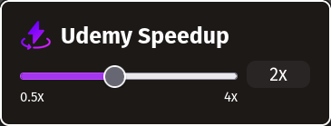

# Udemy Speedup



Get the add-on
[here!](https://addons.mozilla.org/en-US/firefox/addon/udemy-speedup/)

Add more playback rates to Udemy videos. Use the `[` and `]` keys to quickly
change playback. Skip the "Up next" screen and skip long intros or outros if you
so choose!

## Getting Started

Install NodeJS (LTS) version 22. However, if you use nvm or some other version
manager, you can use the `.nvmrc` file to get my exact node version. Run the
following command if you use nvm:

```bash
nvm install
```

Then install the necessary packages for this project:

```bash
npm i
```

To run the extension, I used `web-ext` for my development environment. You can
find how to install it
[here](https://extensionworkshop.com/documentation/develop/getting-started-with-web-ext/).
However if you're already using node/npm then run:

```bash
npm install --global web-ext
```

Then run the following to open up the environment:

```bash
web-ext run
```

## Using Webpack

I'm using webpack to convert the typescript to javascript. This is output to the
`dist` directory. The input typescript files are declared in `webpack.config.js`
Run the following to generate the javascript:

```bash
npm run build
```

For development:

```bash
npm run dev
```

## Using Tailwind

I'm using tailwindcss to style my extension, so we'll need to generate the css.
This will take the `input.css` and generates the `output.css`. Run the following
command in the root project to generate the css once:

```bash
npm run tailwind:build
```

For development:

```bash
npm run tailwind:watch
```
