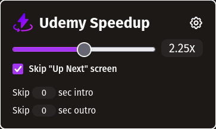

# Udemy Speedup



Get the add-on [here!](https://addons.mozilla.org/en-US/firefox/addon/udemy-speedup/)

This extension adds playback rates to Udemy videos. Ranging from 0.5x to 4x speed.
The user can either use the range input or the text input for finer control if they so choose. They can also use the `[` and `]` keys to quickly change playback by 0.25 speed.

**NOTE**: It may not apply at times, if that happens just refresh the page.

## Steps to build/edit extension

Install NodeJS (LTS) version 20. However if you use nvm, you can use the `.nvmrc` file to get my exact node version. Run the following command within the project

```bash
nvm install
```

I used `web-ext` for my development environment. You can find how to install it [here](https://extensionworkshop.com/documentation/develop/getting-started-with-web-ext/). However if you're already using node/npm then run.

```bash
npm install --global web-ext
```

Then run the following to open up the environment

```bash
web-ext run
```

### Styling

I'm using tailwindcss to style my extension, so we'll need to generate the css. This will take the `input.css` and generates the `output.css`. Run the following command in the root project to generate the css once.

```bash
npm run tailwind:build
```

If you want to make and watch your changes.

```bash
npm run tailwind:watch
```

## Layout

Using the following command

```bash
tree -I ".git|node_modules"
```

You'll get the structure of the project. Let's run it down.

- The `background` dir has a **background.js**. It has 3 responsibilities.
  - To control whether the extension is enabled or not based on the URL.
  - Listens when the user enters a shortcut. Telling the popup.js to correctly reflect the new playback speed.
  - Update the playback text on screen when the user clicks onto a new Udemy tab.
    - It does this by running the content script **5_update_playback_text.js**.
- The `popup` dir has files to control the look and behaviour of the extension. Sending and receiving messages from content_scripts. The file **2_popup_listener.js** is where the messages are sent.
